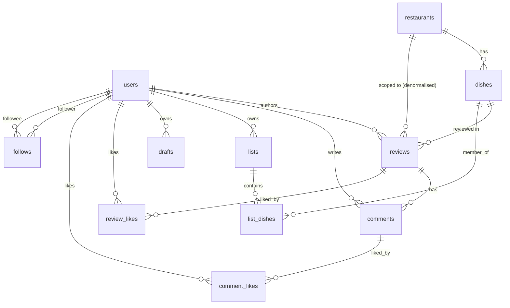

# Ate — Backend Data Model (logical → physical)

> **Status:** PLANNING. Owned by the PM (planning brain). Grounded in the real client data layer as of HEAD `edf916f` (2026-06-15). **Now reflects Eamon's 2026-06-14 decisions** (Google-Places-backed restaurants, UGC dishes, restaurant-rating = mean of per-dish averages, dish merge/dedup) — see the Decisions block below.
> **Purpose:** the full data model a backend would need to replace the current persisted zustand store, so Eamon can stand up Phase 3 (real auth + multi-user + server).
> **Source of truth for shapes:** `src/data/types.ts`, `src/data/store.ts`, `src/data/fixtures.ts`, `src/data/auth.ts`. Every entity below is anchored to those files.
> **Scope discipline:** the *logical* model (entities §1–5, access §5, media §6, sync §7, API §8) is deliberately **stack-agnostic**. All stack-specific (Postgres vs Firestore vs …) notes are isolated in §9 (Open Decisions).

---

## Decisions (Eamon, 2026-06-14)

The following are now **LOCKED** (resolving the highest-impact open questions from §9). They are folded into the entity tables, keys, constraints, and access patterns below.

1. **Restaurants are Google-Places-backed, not user free-text.** Restaurants are resolved/imported from Google Places to enable GPS "nearby" features. Natural key becomes **`google_place_id` (UNIQUE)**, replacing the old `(name, city)` key. The "create restaurant" write path is "resolve a Google Place → **upsert** a `restaurants` row by `google_place_id`" — a *curated import*, never arbitrary user text. Adds geolocation + a **"nearby" access pattern** (new capability, not in the current client) → PostGIS. (§1.2, §3, §5)
   - **EXCEPTION — manual restaurants (MANUAL-RESTO, migration 0014).** A second, narrow source exists for places Google Places can't find: a **`source`** discriminator (`'places'` default · `'manual'`) splits the catalogue. Manual rows have **`google_place_id = NULL`** (so `google_place_id` is now **nullable**; the total UNIQUE became a **partial unique index `WHERE google_place_id IS NOT NULL`** — Places rows stay deduped by Place id, many manual NULL-place_id rows coexist). A two-way **CHECK** pins the invariant: `(source='places' AND google_place_id IS NOT NULL) OR (source='manual' AND google_place_id IS NULL)`. Manual rows are created ONLY via the SECURITY-DEFINER RPC **`add_manual_restaurant(p_name, p_city?, p_cuisine?, p_address?)`** (EXECUTE → `authenticated` only; gated on `auth.uid()`), which hard-sets `source='manual'`/`google_place_id=NULL` — preserving 0008's hardening (no broad end-user INSERT policy on `restaurants`). Manual restaurants are **globally shared catalogue data** (visible to all in search), NOT per-user-owned; UPDATE/DELETE stay admin-only exactly as for Places rows. The schema reuses the existing `name`/`city`/`cuisine`/`address` columns (no new field columns) so it already covers the E-MANUALR-1 form whatever Eamon picks. Reconciling duplicate manual rows is a future moderation/merge concern (mirrors the dish-merge op, §4), not a constraint. (§1.2, §3, §8)
2. **Dishes are user-generated, shared globally.** A user adds a dish *inside* a predetermined (Google Places) restaurant; once added it is available for **all** users to log against — one shared catalogue row per `(name, restaurant_id)`. Identity `(name, restaurant_id)` UNIQUE is **CONFIRMED**. Adds **`created_by_user_id`** for attribution. The add-dish UX is **search-existing-first** (autocomplete the restaurant's existing dishes; only create a new row as fallback) — the product mechanic that makes the rating flywheel work. (§1.3, §3)
3. **Dish dedup / merge.** The model supports merging near-duplicate dishes ("Brisket" / "Beef Brisket") via a tombstone: **`merged_into_dish_id`** (nullable self-ref FK). On merge of B→A: B's `reviews` and `list_dishes` repoint to A, B is tombstoned (`merged_into_dish_id = A`), reads of B redirect to A. Preserves accumulated ratings. (§1.3, §4)
4. **Restaurant rating = mean of per-dish averages**, *not* the average of all individual reviews. Each dish's average score counts once; dishes with no reviews (score NULL) are excluded. **This diverges from current client code** (`useRestaurantStats` averages reviews directly, `store.ts:369-371`) — FE must change the selector. (§1.2, §5)

Also **DECIDED** (Eamon, 2026-06-14 round 2, see §9.C): **save = list membership** (no separate saves table); account deletion = **soft-delete/tombstone**; realtime = **narrow** (viewed surface only); feed = **fan-out-on-read + keyset pagination**; drafts = **client-local for v1**. The only item still pending is Eamon's nod on the **stack (§9.A — Supabase recommended)**.

---

## 0. The one modelling decision that shapes everything: dish & restaurant identity

The current client does **not** have stable IDs for dishes or restaurants. It identifies them by **name string**:

- A `Review` references its dish and restaurant as free-text strings (`review.dish`, `review.restaurant`) — `src/data/types.ts:18-32`.
- A `Restaurant` has **no `id` at all** — its natural key is `name` (`src/data/types.ts:46-51`), looked up via `getRestaurant(name)` (`fixtures.ts:553`).
- A `Dish` *has* an `id` but it is **never used for joins** — every selector keys off `name` (`useDish(name)`, `useReviewsByDish(name)`, `useDishes(restaurant)` — `store.ts:355,400,413`), and lists store **dish names**, not ids (`SavedList.dishNames`, `types.ts:72`). Routes are `/dish/:name` and `/restaurant/:name` (`search.tsx:108`, `restaurant/[id].tsx:24`).
- **Crucially, a dish's true identity is the COMPOSITE `(name, restaurant)`** — the same name at a different restaurant is a different menu item. The fixtures encode this explicitly: there are two "Beef Rib" dishes (`d2` at Goldee's, `d11` at Smoke Ring Co.) and aggregates are scoped to *both* fields (`fixtures.ts:511-515`). The store's `useRestaurantStats` filters reviews by `r.restaurant === restaurant` (`store.ts:369`).

**Implication for the backend:** we must promote dishes and restaurants to **first-class rows with surrogate UUID PKs**, and give every review a real `dish_id` / `restaurant_id` FK instead of a name string. This is the single biggest logical-shape change between client and server. The client's name-based routing can stay as a slug façade (§6/§8), but the data model must not.

**DECIDED (Eamon, 2026-06-14):** the "(name, restaurant) = one unique menu item" rule is **CONFIRMED**, and dishes/restaurants are a **shared global catalogue** (not per-user). Two further decisions land on top of this surrogate-PK promotion:
- **Restaurants** are no longer keyed by name at all — they are **Google-Places-backed**, with `google_place_id` (UNIQUE) as the natural key (§1.2, §3). The name→id concern for restaurants dissolves: restaurants arrive pre-resolved from Places, not minted from free text.
- **Dishes** are **user-generated** within those Places restaurants and **deduped via merge** (`merged_into_dish_id` tombstone, §1.3/§4), which is how "(name, restaurant) uniqueness" is reconciled in practice when two users add near-duplicate names.

See §3 (Keys) and the Decisions block above; only the *physical* stack questions remain open (§9).

---

## 1. Entity catalog

Eleven entities (8 stored tables + 3 join/edge tables). Stored-vs-derived is called out per field; derived fields are **never persisted** server-side — they are computed on read (or denormalised as a cache, see §5).

### 1.1 `users`
Maps to `User` (`types.ts:6-15`) + the auth seam (`auth.ts`). The seeded "me" (`fixtures.ts:153`) becomes the authenticated row in Phase 3.

| Field | Type | Null? | Stored/Derived | Notes / source |
|---|---|---|---|---|
| `id` | UUID | no | stored (PK) | Replaces literal ids like `u_me`, `u_feastfix` (`fixtures.ts:154,52`). |
| `name` | text | no | stored | Display name, e.g. "Marisa Vance" (`types.ts:8`). |
| `username` | citext | no | stored, **UNIQUE** | Handle without `@`; routing + search key (`types.ts:9`, `search.tsx:73`). |
| `avatar_url` | text | yes | stored | Object-storage URL (today a remote URI, `fixtures.ts:55`). See §6. |
| `bio` | text | yes | stored | `types.ts:11`. |
| `email` | citext | no | stored, **UNIQUE** | New for Phase 3 — auth identity, not in current client. |
| `auth_provider_id` | text | no | stored, **UNIQUE** | New — the IdP subject (Apple/Google sub). See §3. |
| `created_at` | timestamptz | no | stored | New — needed for "joined" + ordering. |
| `reviews` (count) | int | — | **DERIVED** | `COUNT(reviews WHERE reviewer_id=user.id)`. Client computes this live: `me.reviews` is the count of authored diary entries, bumped on `logReview` (`store.ts:47,152`); other users via `userReviewCount` (`fixtures.ts:528`). PV5-5 honesty rule. |
| `followers` (count) | int | — | **DERIVED** | `COUNT(follows WHERE followee_id=user.id)`. Client: `followerCount` (`fixtures.ts:531`), kept in sync on `toggleFollow` (`store.ts:182`). |
| `following` (count) | int | — | **DERIVED** | `COUNT(follows WHERE follower_id=user.id)`. Client: `followingCount` (`fixtures.ts:534`); for `me` it's `following.length` (`store.ts:394`). |
| `dishes_reviewed` (count) | int | — | **DERIVED** | `COUNT(DISTINCT dish_id FROM reviews WHERE reviewer_id=user.id)`. Profile-stat (PV5-5). |

> **PV5-5 rule, restated for the backend:** `reviews`, `followers`, `following`, `dishes_reviewed` are **counts derived from the edge/review tables, never hand-stored.** The client computes them on read; the server should do the same (a view or `COUNT()` query), optionally caching them as a denormalised counter (§5) for feed/profile performance.

### 1.2 `restaurants`
Maps to `Restaurant` (`types.ts:46-51`). Currently has **no id** — name was the key. Backend promotes it to a UUID PK. **DECIDED:** restaurants are **Google-Places-backed** — natural key is `google_place_id`, and the write path is "resolve a Place → **upsert** by `google_place_id`" (a curated import, never arbitrary user text). Geolocation enables the new "nearby" feature (§5).

| Field | Type | Null? | Stored/Derived | Notes / source |
|---|---|---|---|---|
| `id` | UUID | no | stored (PK) | **New** — restaurants have no id today (`types.ts:46`). |
| `source` | text | no (default `'places'`) | stored | **New (MANUAL-RESTO, 0014).** Catalogue origin: `'places'` (Google-Places-backed) or `'manual'` (user-entered via `add_manual_restaurant`). CHECK `source IN ('places','manual')`. Existing rows backfilled to `'places'`. Pairs with `google_place_id` via the two-way invariant CHECK (§3). |
| `google_place_id` | text | **yes** (was no) | stored, **partial UNIQUE** | **Decided; nullable since 0014.** The Places identifier; natural key for `source='places'` rows. **NULL for `source='manual'`.** UNIQUE is a **partial index `WHERE google_place_id IS NOT NULL`** (Places rows deduped; manual NULLs coexist). Upsert target for the "resolve Place → row" path. Replaces the old `(name, city)` natural key (§3). |
| `name` | text | no | stored | `types.ts:47`. From Places, or user-entered for manual rows (required by `add_manual_restaurant`). |
| `address` | text | yes | stored | **New (decided).** Formatted address from Places, or optional user input for manual rows. |
| `city` | text | no | stored | e.g. "Fort Worth, TX" (`fixtures.ts:477`). From Places, or optional user locality for manual rows — **defaults to `''`** when not supplied (kept NOT NULL to avoid widening the `city: string` contract; FE treats `''` as "no locality"). |
| `location` | geography(Point,4326) | yes | stored | **New (decided).** PostGIS point (lat/lng) from Places. Powers the "nearby" GPS query (§5); needs a GIST index. If PostGIS is unavailable, fall back to `lat numeric` + `lng numeric` columns. |
| `cuisine` | text | yes | stored | e.g. "Barbecue" (`types.ts:49`). May come from Places or be **app-augmented** (hence nullable now). |
| `cover_url` | text | yes | stored | Cover image (`types.ts:50`). From Places photos or app-augmented. See §6. |
| `created_at` | timestamptz | no | stored | New. When first imported. |
| `avg_rating` | numeric(2,1) | — | **DERIVED (semantics changed)** | **DECIDED:** mean of the **per-dish averages**, *not* the mean of all individual reviews: `mean(dishes.score WHERE restaurant_id = … AND dishes.score IS NOT NULL)` — each dish counts once; dishes with no reviews (score NULL) are excluded. **Diverges from current client** (`useRestaurantStats.avg` averages reviews directly, `store.ts:371`) — FE must change the selector. *Future refinement (not adopted): a min-reviews-per-dish threshold before a dish counts, so one thin entry can't swing a restaurant.* |
| `review_count` | int | — | **DERIVED** | `COUNT(reviews WHERE restaurant_id=…)`. Client: `useRestaurantStats.reviewCount` (`store.ts:372`). (Total review count is unchanged by the rating-derivation decision.) |
| `cover_url` (derived) | text | yes | **DERIVED (live, IMG-1)** | **New surface (IMG-BE-1, migration 0009).** The `photo_url` of the **most-recent photo'd review at the restaurant** (any dish, any user), or NULL if none. **Live-derived** via a LATERAL subquery in the `restaurant_stats` view (never a stored/denormalised column) — never goes stale. Distinct from the stored `restaurants.cover_url` column (§1.2 row above), which holds the Places/app cover and is left intact; the derived value is surfaced **additively** on the `restaurant_stats` read so the FE can coalesce (derived UGC cover → stored Places cover → placeholder). Mirrors the client's FB3-2 `reviewCoversByDish` semantics (newest review *with* a photo wins) but universal across all users. |

### 1.3 `dishes`
Maps to `Dish` (`types.ts:35-43`). Identity is **(name, restaurant_id)** — see §0. **DECIDED:** dishes are **user-generated** (added inside a Places restaurant) and **shared globally** — once added, any user can log against them. Includes `created_by_user_id` (attribution) and `merged_into_dish_id` (dedup tombstone).

| Field | Type | Null? | Stored/Derived | Notes / source |
|---|---|---|---|---|
| `id` | UUID | no | stored (PK) | `Dish.id` exists today but isn't used for joins (`types.ts:36`); becomes the real FK target. |
| `name` | text | no | stored | `types.ts:37`. Part of natural key with `restaurant_id`. |
| `restaurant_id` | UUID | no | stored (FK→restaurants) | Replaces `Dish.restaurant` name-string (`types.ts:38`). The restaurant is Places-backed (§1.2). |
| `created_by_user_id` | UUID | no | stored (FK→users) | **New (decided).** Attribution: who first added this dish to the shared catalogue. Dishes are UGC. |
| `merged_into_dish_id` | UUID | yes | stored (FK→dishes, self-ref) | **New (decided).** Dedup tombstone: when this dish was merged into a canonical dish, points to the survivor. `NULL` for live dishes; non-null = tombstoned, reads redirect to the target (merge semantics in §4). |
| `category` | text | yes | stored | Menu filter: Meats/Sides/Sweets/Mains (`types.ts:41`, `restaurant/[id].tsx:31`). Candidate enum (§4). |
| `photo_url` | text | yes | stored | `types.ts:42`. See §6. |
| `created_at` | timestamptz | no | stored | New. |
| `score` (avg) | numeric(2,1) | — | **DERIVED** | Mean score of this dish's reviews, 1-dp; `undefined`/null = "want-to-try / unrated" (drives the `?/5` ScoreMark). Client: `dishAvgScore` (`fixtures.ts:518`), mutated into `dish.score` (`fixtures.ts:539`). **Feeds the restaurant `avg_rating`** (mean of these per-dish scores, §1.2). |
| `reviews` (count) | int | — | **DERIVED** | `COUNT(reviews WHERE dish_id=…)`. Client: `dishReviewCount` (`fixtures.ts:525,540`). |
| `cover_url` (derived) | text | yes | **DERIVED (live, IMG-1)** | **New surface (IMG-BE-1, migration 0009).** The `photo_url` of the dish's **most-recent photo'd review** (across ALL reviews, any user), or NULL if none. **Live-derived** via a LATERAL subquery in the `dish_stats` view (never a stored column) — updates the instant a new photo'd review lands or a photo is removed; no trigger, no stale counter. Fixes the universal camera-placeholder bug: `dishes.photo_url` is always NULL (photos live on `reviews.photo_url`), and the client-only FB3-2 fallback only saw the local store's reviews (own + followed), so stranger-reviewed dishes stayed blank. The stored `dishes.photo_url` column is left intact. **Additive** field on the `dish_stats` read (the client already merges `dish_stats` by `dish_id`). |

> **Note:** `score == null` is a *meaningful* product state ("unrated / want-to-try"), not just missing data — the UI renders a distinct `?/5` mark (`search.tsx:107`, `restaurant/[id].tsx:105`). Preserve the null-vs-zero distinction server-side: a dish with zero reviews has `score = NULL`, not `0`. (Null-score dishes are also **excluded** from the restaurant `avg_rating`, §1.2.)

> **Add-dish UX — search-existing-first (product mechanic, not a schema field):** the compose/add flow must **autocomplete the restaurant's existing dishes** and only create a new `dishes` row as a fallback when no match exists. This is what makes the rating flywheel work — it funnels users onto the *shared* catalogue row so ratings accumulate, instead of fragmenting into per-user duplicates. **FE/design implication:** the add-review flow needs a typeahead against `GET /restaurants/:id/dishes` (or a dish-search-within-restaurant endpoint) ahead of the "create new dish" path. Flag for FE + design when Phase 3 compose is built.

### 1.4 `reviews` (the atomic unit of Ate)
Maps to `Review` (`types.ts:18-32`). The most important table. Note the client *embeds* the full `reviewer: User` object and uses name-strings for dish/restaurant — the backend normalises both to FKs.

| Field | Type | Null? | Stored/Derived | Notes / source |
|---|---|---|---|---|
| `id` | UUID | no | stored (PK) | Replaces `r1`…`r12`, `r_me_1`, and local `r_local_*` ids (`store.ts:41,138`). |
| `reviewer_id` | UUID | no | stored (FK→users) | Replaces embedded `Review.reviewer: User` (`types.ts:19`). |
| `dish_id` | UUID | no | stored (FK→dishes) | Replaces `Review.dish` name-string (`types.ts:20`). Implies the restaurant via the dish. |
| `restaurant_id` | UUID | no | stored (FK→restaurants) | Denormalised from the dish for fast "reviews by restaurant" queries (matches `Review.restaurant`, `types.ts:21`). Must equal `dishes.restaurant_id`. |
| `score` | numeric(2,1) | no | stored | 0.5–5.0 in half-steps (`types.ts:23`; compose enforces `>= 0.5`, `compose.tsx:54,161`). Constraint §4. |
| `note` | text | yes | stored | Optional review body (`types.ts:24`). |
| `photo_url` | text | yes | stored | Optional photo (`types.ts:25`). See §6. |
| `created_at` | timestamptz | no | stored | **Replaces the display strings** `time` ("2d") and `logged` ("12 May 2026") — those are *formatted views* of one timestamp (`types.ts:26-27`, `todayLabel()` `store.ts:295`). Server stores the instant; client formats. |
| `likes` (count) | int | — | **DERIVED** | `COUNT(likes WHERE review_id=…)`. Client stores it inline + toggles (`types.ts:28`, `store.ts:169`) — that's an optimistic cache; server derives it. |
| `comments` (count) | int | — | **DERIVED** | `COUNT(comments WHERE review_id=…)`. Client keeps inline (`types.ts:29`, `store.ts:194`). |
| `liked` (by me) | bool | — | **DERIVED per-viewer** | `EXISTS(likes WHERE review_id=… AND user_id=:me)` (`types.ts:30`). Viewer-relative — not a column on the row; resolved per request. |
| `saved` (by me) | bool | — | **DERIVED per-viewer** | `EXISTS(saves/list-membership for :me)` (`types.ts:31`). Client derives "saved" from list membership: `useIsDishSaved` checks any list's `dishNames` (`store.ts:351`). See §1.8 / the modelling note there. |

### 1.5 `comments`
Maps to `Comment` (`types.ts:53-60`), stored client-side as `commentsByReview: Record<reviewId, Comment[]>` (`store.ts:80`).

| Field | Type | Null? | Stored/Derived | Notes / source |
|---|---|---|---|---|
| `id` | UUID | no | stored (PK) | Replaces `c1`…, `rc1`…, local `c_local_*` (`store.ts:188`). |
| `review_id` | UUID | no | stored (FK→reviews) | The `commentsByReview` map key (`store.ts:190`). Indexed. |
| `user_id` | UUID | no | stored (FK→users) | Replaces embedded `Comment.user` (`types.ts:55`). |
| `text` | text | no | stored | `types.ts:56`. |
| `created_at` | timestamptz | no | stored | Replaces display `time` ("1d") (`types.ts:57`). |
| `likes` (count) | int | — | **DERIVED** | `COUNT(comment_likes WHERE comment_id=…)` (`types.ts:58`, `store.ts:204`). |
| `liked` (by me) | bool | — | **DERIVED per-viewer** | `EXISTS(comment_likes WHERE comment_id=… AND user_id=:me)` (`types.ts:59`). |

### 1.6 `lists` (saved lists / collections)
Maps to `SavedList` (`types.ts:62-73`). The membership (`dishNames: string[]`) becomes a join table — see §1.10.

| Field | Type | Null? | Stored/Derived | Notes / source |
|---|---|---|---|---|
| `id` | UUID | no | stored (PK) | Replaces `l_saved`, `l_bbq`, local `l_local_*` (`store.ts:210`). |
| `owner_id` | UUID | no | stored (FK→users) | **New/explicit.** Today implicit (`me`) or via `byline` handle for bespoke lists (`types.ts:69`, `fixtures.ts:448`). Make ownership a real FK. |
| `name` | text | no | stored | `types.ts:63`. |
| `description` | text | yes | stored | `types.ts:70`. |
| `cover_url` | text | yes | stored | `types.ts:64`. See §6. |
| `pinned` | bool | no (default false) | stored | The "Saved" list is pinned (`types.ts:69`, `fixtures.ts:423`). |
| `is_system` | bool | no (default false) | stored | **New.** The default "Saved" list is special (auto-created per user). Distinguishes it from user-made lists. |
| `created_at` | timestamptz | no | stored | New. |
| `dishCount` / `meta` | int / text | — | **DERIVED** | `dishCount = COUNT(list_dishes WHERE list_id=…)`; `meta` is a *formatted string* ("12 dishes") — UI concern, not stored (`types.ts:66-67`, `store.ts:217,241`). |
| `byline` | — | — | **DERIVED** | `users.username` of `owner_id` (`types.ts:69`). Don't store separately. |

### 1.7 `follows` (edge table — the social graph)
Maps to the `follows: Record<ID, ID[]>` graph (`fixtures.ts:493`) + the store's `following: ID[]` (`store.ts:82`). **M:N self-referential on users.**

| Field | Type | Null? | Stored/Derived | Notes |
|---|---|---|---|---|
| `follower_id` | UUID | no | stored (FK→users) | `follows[follower]` keys (`fixtures.ts:494`). |
| `followee_id` | UUID | no | stored (FK→users) | members of that list. |
| `created_at` | timestamptz | no | stored | For "recently followed". |

- **PK / uniqueness:** composite `(follower_id, followee_id)` — at most one follow per pair (§3).
- **Constraint:** `follower_id <> followee_id` (no self-follow).

### 1.8 `review_likes` (edge table)
Backs `Review.liked`/`likes` (`toggleLike`, `store.ts:166`). **M:N users↔reviews.**

| Field | Type | Null? | Notes |
|---|---|---|---|
| `user_id` | UUID | no | FK→users |
| `review_id` | UUID | no | FK→reviews (cascade-delete with the review) |
| `created_at` | timestamptz | no | |

- **PK:** `(user_id, review_id)` — one like per user per review.

### 1.9 `comment_likes` (edge table)
Backs `Comment.liked`/`likes` (`toggleCommentLike`, `store.ts:199`). **M:N users↔comments.** Same shape as `review_likes` (`(user_id, comment_id)` PK, cascade with comment).

### 1.10 `list_dishes` (membership edge table)
Backs `SavedList.dishNames` (`types.ts:72`) + `toggleDishInList` (`store.ts:234`). **M:N lists↔dishes.**

| Field | Type | Null? | Notes |
|---|---|---|---|
| `list_id` | UUID | no | FK→lists (cascade-delete with the list) |
| `dish_id` | UUID | no | FK→dishes — **replaces the dish-NAME string membership** (`types.ts:72`). See migration note. |
| `position` | int | yes | For ranked/ordered lists ("definitive ranked brisket list", `fixtures.ts:449`). |
| `added_at` | timestamptz | no | |

- **PK:** `(list_id, dish_id)`.
- **Migration note:** today membership is by **dish name** (route-stable). The backend keys it by `dish_id`. Because dish identity is `(name, restaurant)` (§0), the name→id mapping is only unambiguous once restaurants are real rows. This is part of why §0 is the load-bearing decision. The "Saved by me" boolean (`Review.saved`, `useIsDishSaved`) is derived from membership of any of the viewer's lists — *not* a separate `saves` table. **Decided (Eamon, §9.C):** **save = list membership** (a save is membership in the user's default list); no standalone bookmark concept.

### 1.11 `drafts` (#30 — in-progress compose sessions)
Maps to `ReviewDraft` (`store.ts:63-72`). Persisted alongside reviews; client surfaces only the most recent (`useLatestDraft`, `store.ts:421`).

| Field | Type | Null? | Stored/Derived | Notes |
|---|---|---|---|---|
| `id` | UUID | no | stored (PK) | local `d_local_*` (`compose.tsx:26`). |
| `owner_id` | UUID | no | stored (FK→users) | Drafts are per-user. |
| `dish_name` | text | yes | stored | A draft may reference a *not-yet-existing* dish (free text in compose, `compose.tsx:37`) → keep as text + optional `dish_id`. |
| `restaurant_name` | text | yes | stored | Same — free text until resolved (`compose.tsx:38`). |
| `score` | numeric(2,1) | yes | stored | `0` = not yet rated (`store.ts:64`). |
| `note` | text | yes | stored | `store.ts:66`. |
| `photo_url` | text | yes | stored | Local URI today; needs upload on promote (`store.ts:67`). See §6/§7. |
| `saved_at` | timestamptz | no | stored | Recency ordering (`store.ts:71`). |

> **Decided (Eamon, §9.C):** drafts stay **client-local for v1** — transient, single-device, pre-publish; no server `drafts` table. Cross-device draft sync is a deferred enhancement. (Closes the `#30` `needs-Eamon` board carry-over.)

### 1.12 `review_tags` (#6 TAGGING) + 1.13 `notifications` (#2 NOTIF) — Batch 5
Two feature tables added Batch 5 (migrations `0010_review_tags.sql`, `0011_notifications.sql`). Their full shapes, the FE queries/RPCs, the Realtime channels, and the soft-dismiss/respond mutations live in a dedicated contract doc — **see `docs/backend/tagging-notif-contract.md`** (kept separate so the FE has one crisp surface to build against). Summary:
- **`review_tags`** — edge `(review_id, tagged_user_id)` PK; tag dining companions on a review (spike model b: independent reviews funnelled onto one shared `dish_id`). Denormalised `tagger_id` (trigger-set), model-B `responding_review_id` back-link, `status` (pending/rated/dismissed). **Scope = follows-only** (you can only tag people you follow). Read = both parties only (semi-private). **First Realtime-published table.**
- **`notifications`** — polymorphic unified centre: `recipient_id, actor_id, type∈{like,comment,follow,tag}, review_id?, comment_id?, read_at, dismissed_at`. Source triggers fan out a notification on each event (self-suppressed). **Dismiss = soft-delete** (`dismissed_at`); **unread badge = TOTAL** unread via `unread_notification_count()`. Recipient-only RLS; Realtime-published. Rows are trigger-created (no client insert) and soft-dismissed (no client delete).

---

## 2. Relationships & ER overview

Cardinality summary:

| Relationship | Cardinality | Mechanism |
|---|---|---|
| user → reviews | 1:N | `reviews.reviewer_id` FK |
| restaurant → dishes | 1:N | `dishes.restaurant_id` FK |
| dish → reviews | 1:N | `reviews.dish_id` FK |
| review → comments | 1:N | `comments.review_id` FK |
| user → lists | 1:N | `lists.owner_id` FK |
| user → drafts | 1:N | `drafts.owner_id` FK |
| **user ↔ user (follow)** | **M:N** | `follows` edge `(follower_id, followee_id)` |
| **user ↔ review (like)** | **M:N** | `review_likes` edge |
| **user ↔ comment (like)** | **M:N** | `comment_likes` edge |
| **list ↔ dish (membership)** | **M:N** | `list_dishes` edge |

---

## 3. Keys & identity

- **PK strategy: UUID v4 (or v7 for time-sortable) surrogate keys on every entity.** Rationale: the client already mints opaque string ids (`u_me`, `r1`, `l_local_…` — `store.ts:41`) and never relies on monotonic ordering of ids (it orders by recency/`savedAt`). UUIDs let the **client generate ids optimistically** before the server round-trips (critical for the offline-first store, §7) and avoid serial-collision on merge. UUID v7 is preferred if the stack supports it (time-ordered → better index locality for the feed).
- **Natural keys / uniqueness constraints:**
  - `users.username` UNIQUE (case-insensitive — use `citext`); it's the search + routing key (`search.tsx:73`).
  - `users.email` UNIQUE, `users.auth_provider_id` UNIQUE.
  - `restaurants.google_place_id` **partial** UNIQUE (`WHERE google_place_id IS NOT NULL`, since 0014) — **natural key for `source='places'` rows.** Replaces the old `(name, city)` key. Places rows are upserted by `google_place_id`; a single Place resolves to exactly one row. `source='manual'` rows have `google_place_id = NULL` and are deliberately NOT deduped by this index (many manual NULL rows coexist). The two-way CHECK `restaurants_source_placeid_ck` — `(source='places' AND google_place_id IS NOT NULL) OR (source='manual' AND google_place_id IS NULL)` — keeps the two row kinds unconfusable on every write path. (The old `(name, city)` collision concern dissolves for Places rows — identity comes from Places, not free text.)
  - `dishes (name, restaurant_id)` UNIQUE — **the §0 composite identity, CONFIRMED.** Enforces "same name, same restaurant = same dish; same name, different restaurant = different dish." Dishes are UGC + shared globally; near-duplicate names within a restaurant are reconciled by the **merge** operation (§4), not by a stricter constraint. Tombstoned dishes (`merged_into_dish_id IS NOT NULL`) are excluded from the live catalogue but retained for redirect/history — so the UNIQUE constraint should be **partial** (`WHERE merged_into_dish_id IS NULL`) to allow a tombstone to coexist with its survivor.
  - `follows (follower_id, followee_id)` UNIQUE; `review_likes (user_id, review_id)` UNIQUE; `comment_likes (user_id, comment_id)` UNIQUE; `list_dishes (list_id, dish_id)` UNIQUE.
- **Auth / identity model:** the client already has the seam — `auth.ts` defines `Session { userId, user }`, `useSession()`, `signIn`/`signOut` (currently no-op stubs over the single seeded `me`). Phase 3 wiring:
  1. IdP (Apple/Google) returns a subject (`sub`) + email on sign-in.
  2. Backend upserts a `users` row keyed by `auth_provider_id` (first sign-in creates the profile; the seeded `eamon`/`u_me` becomes a real authenticated row).
  3. `useSession()` returns that row (instead of `useMe()`); `null` when signed out → gate to onboarding (`auth.ts:13`).
  4. The authenticated `user.id` is the `reviewer_id`/`owner_id`/`:me` in every query. Row-level security (if Supabase/Postgres) scopes writes to `auth.uid() == owner_id`.

---

## 4. Constraints & enumerations

- **Rating scale:** `score` is `numeric(2,1)`, `0.5 ≤ score ≤ 5.0`, half-step increments. Enforced today in compose (`canPost = score >= 0.5`, `rate()` rounds to 0.5 — `compose.tsx:54,161`). Add a CHECK: `score IN (0.5,1.0,…,5.0)` or `score*2 = round(score*2) AND score BETWEEN 0.5 AND 5`.
- **Dish unrated state:** `dishes.score` (the derived avg) is `NULL` when review_count = 0 — a meaningful "want-to-try" state, must not collapse to 0 (§1.3).
- **`dish.category` enum (candidate):** `{Meats, Sides, Sweets, Mains}` observed (`fixtures.ts:402-414`). Confirm the closed set with Eamon before making it a DB enum vs free text — menus may need more categories. Recommend free text + app-side curation for v1 (enums are migration-painful).
- **Review status enum:** today there is **no published/draft flag on `reviews`** — drafts are a *separate* table (`drafts`, §1.11), and a review only exists once posted (`logReview`, `store.ts:135`). Recommend keeping it that way (draft ≠ a review with status='draft'); avoids a status column entirely. If Eamon wants moderation later, add `status {published, hidden, removed}`.
- **Required vs optional:** required: every FK, `score`, `users.username/email`, `restaurants.name/city/cuisine`, `dishes.name`. Optional (nullable): `note`, all `*_url` (photo/avatar/cover), `bio`, `description`, `category`.
- **Referential integrity / cascades:**
  - Delete a review → **CASCADE** its `comments`, `review_likes`, and its rows in nothing else (lists reference dishes, not reviews). Mirrors `deleteReview` (`store.ts:160`) which today just drops the review; comments are orphaned in the map — the server should cascade them.
  - Delete a comment → CASCADE its `comment_likes`.
  - Delete a list → CASCADE `list_dishes` (membership only; dishes survive). Mirrors `deleteList` (`store.ts:232`).
  - Delete a user → policy decision (§9): hard-cascade all their content, or soft-delete (tombstone) to preserve thread integrity. Recommend **soft-delete** (`deleted_at`) so others' comment threads don't lose context.
  - Restaurants are **shared catalogue reference data** — created by the "resolve Place → upsert" path (`source='places'`) OR the `add_manual_restaurant` RPC (`source='manual'`, MANUAL-RESTO/0014); never end-user-updatable or -deletable (no UPDATE/DELETE policy). Non-cascading toward reviews/dishes.
  - Dishes are **UGC catalogue data** — shared globally, not individually user-deletable (a user can't delete a dish others have logged against). They are removed only via **merge** (below), not DELETE. Non-cascading toward reviews/lists.
- **Geo constraint:** `restaurants.location` should carry a **PostGIS GIST index** (the "nearby" access pattern, §5). If using `lat`/`lng` fallback columns, both are nullable but should be set together (CHECK `(lat IS NULL) = (lng IS NULL)`).
- **Dish merge / dedup (decided — the operation, not a passive constraint):** to reconcile near-duplicates ("Brisket" / "Beef Brisket"), an admin (or future moderation tool) merges dish **B into canonical dish A**. The operation, run transactionally:
  1. **Repoint** `reviews.dish_id` from B → A (B's ratings now accrue to A — this is the whole point: preserve accumulated ratings).
  2. **Repoint** `list_dishes.dish_id` from B → A (de-dup any resulting `(list_id, dish_id)` collision — if a list already had A, drop the duplicate B-membership row rather than violate the PK).
  3. **Tombstone** B: set `dishes.merged_into_dish_id = A.id`. B keeps its row for history + redirect.
  4. **Reads of B redirect to A:** any `GET /dishes/:B` or `/dish/:slug` resolving to a tombstoned dish returns A (follow `merged_into_dish_id`); the partial UNIQUE on `(name, restaurant_id)` (§3) lets A and the tombstoned B coexist.
  Merge is idempotent-ish (chains should be flattened — if A is itself later merged into C, B's redirect should resolve transitively to C). Recommend a max one-hop resolution at read time plus a periodic chain-flatten job.

---

## 5. Access patterns → indexing

Per-screen read/write inventory (from the screens + `store.ts` selectors), with the index each implies.

| Screen / surface | Reads (selector → query) | Writes (action) | Index implied |
|---|---|---|---|
| **Home feed** (`(tabs)/index.tsx`) | `useFeed`: reviews by people `me` follows, **plus the viewer's own posts** (union composed client-side; FB3-1), newest-first (`store.ts:313`). The server `get_feed` RPC is following-only (excludes own) — see the composition contract below. | — | `reviews(created_at DESC)`; `follows(follower_id)`; composite for fan-out (see below) |
| **Dish detail** (`dish/[id].tsx`) | `useReviewsByDish(name)` (`store.ts:355`), `useDish` (`store.ts:400`), `useIsDishSaved` (`store.ts:351`) | `toggleLike`, `addComment`, `toggleSaveReview` | `reviews(dish_id, created_at DESC)` |
| **Restaurant detail** (`restaurant/[id].tsx`) | `useDishes(restaurant)` (`store.ts:413`), `useRestaurantStats` (`store.ts:366`) | — | `dishes(restaurant_id)`; `reviews(restaurant_id)` for `review_count`. **`avg_rating` now reads `dishes.score` for this restaurant, not raw reviews** (decided, §1.2) → relies on `dishes(restaurant_id)` + the dish-score aggregate, *not* a reviews scan. **FE must change `useRestaurantStats.avg`.** |
| **Nearby restaurants** (NEW — not in current client) | "restaurants near my GPS point, by distance" — a Phase-3 capability unlocked by Places + geolocation | — (read), plus the Places-resolve **upsert** write path | **PostGIS GIST** on `restaurants.location`; query `ORDER BY location <-> :userPoint LIMIT n` (KNN) or `ST_DWithin(location, :userPoint, :radius)` |
| **Profile** self+visitor (`profile/[id].tsx`) | `useUser`, `useDiary(userId)` (`store.ts:320`), `useFollowCounts` (`store.ts:387`) | `toggleFollow`, `updateMe` | `reviews(reviewer_id, created_at DESC)`; `follows(follower_id)` + `follows(followee_id)` |
| **Search** (`(tabs)/search.tsx`) | dish/restaurant/people text match (`search.tsx:55-74`) | — | trigram/`pg_trgm` on `dishes.name`, `restaurants.name`, `users.username`; or external search index |
| **Log "Where" search-blend** | Places autocomplete ∪ fuzzy match against **restaurants we already hold (any `source`)**, merged server-side in `places-search` op=autocomplete (`results[]`, capped 5, discriminated). Local half = `search_local_restaurants(q)` RPC (**0017**, widened from 0015's manual-only search so a known restaurant shadows its own Google prediction — no resolve, no duplicate row). | — (read) | **total GIN trigram** `restaurants_name_trgm` (0002) covers both branches; word_similarity (`<%`) + ILIKE, threshold 0.45. See `manual-search-blend-contract.md`. |
| **Comments** (`comments/[postId].tsx`) | `useComments(reviewId)` (`store.ts:324`) | `addComment`, `toggleCommentLike` | `comments(review_id, created_at ASC)` |
| **Saved / lists** (`(tabs)/saved.tsx`, `list/[id].tsx`) | `useLists`, `useList` (`store.ts:328,347`) + membership | `createList`, `deleteList`, `toggleDishInList` | `lists(owner_id)`; `list_dishes(list_id)`, `list_dishes(dish_id)` |
| **Followers** (`followers/[id].tsx`) | follow edges for a user | `toggleFollow` | `follows(followee_id)` |
| **Compose / log** (`log/compose.tsx`) | `useDraft`, `useReview` (edit path) | `logReview`, `editReview`, `saveDraft`, `deleteDraft` | `drafts(owner_id, saved_at DESC)` |

**Feed generation — a decision to flag (§9):**
- The client today does **fan-out-on-read**: it filters the full review list by the follow set at render (`useFeed`, `store.ts:313`). That's fine at fixture scale.
- At backend scale, choose: **fan-out-on-read** (query `reviews JOIN follows` ordered by `created_at`, paginated) — simplest, consistent, good up to mid scale; or **fan-out-on-write** (materialise each follower's feed on post) — faster reads, much more write complexity + storage.
- **Recommendation: fan-out-on-read with keyset pagination** (`WHERE created_at < :cursor ORDER BY created_at DESC LIMIT n`) for v1. Ate's per-user post volume is low (a dish diary, not a firehose); read-time join is more than adequate and avoids feed-fanout infrastructure. Revisit only if the follow graph + post rate grow large.

**Home-feed composition contract (FB3-1) — the union is CLIENT-SIDE:**
- **Home feed = `get_feed(viewer)` ∪ viewer's own diary, composed in the RN client.** `get_feed` (`supabase/migrations/0005_functions_views.sql:274`) is **following-only by design** and deliberately **excludes own posts** (`where r.reviewer_id <> auth.uid()`). The viewer's own posts are overlaid client-side: they arrive via the unbounded diary load and are merged + de-duped + recency-sorted into the client store at bootstrap. So `get_feed` is a **primitive, not a complete feed** — a direct consumer that reads `get_feed` alone (web/native/SSR/analytics) will silently miss the viewer's own posts. To get the Home-feed contract you must compose the union; `get_feed` on its own is the following-only half.
- ⚠️ **Load-more precondition 1 (k-way merge, not concat).** `get_feed` is keyset-paginated on `(created_at, id)` and its cursor **never sees own posts**. A load-more path MUST k-way-merge the diary and feed pages by recency — a naive concat-append (feed page then diary) breaks the global recency sort and strands own posts between feed pages.
- ⚠️ **Load-more precondition 2 (diary is unbounded).** `getDiary` is currently **unbounded** (`src/data/api/reviewsApi.ts:63-71` — full `reviewer_id` scan, no cursor), which is *what makes the client-side union complete*. If diary is ever capped/paginated for perf, it MUST paginate in lockstep with the feed; otherwise older own posts silently vanish from the Home feed.

**Pagination:** every list query above (feed, diary, comments, search, reviews-by-dish) needs **keyset/cursor pagination** on `(created_at, id)` — not OFFSET. The client lists are currently unbounded (whole arrays); the API must page.

**IMG-1 cover derivation (additive contract, migration 0009):** dish and restaurant thumbnails/heroes need a real photo universally, not just for the viewer's own/followed reviews. Both stat views now expose a **live-derived `cover_url`** appended additively:
- `dish_stats.cover_url` = `photo_url` of the dish's **most-recent photo'd review** (any user), via `LEFT JOIN LATERAL (… reviews where dish_id = d.id and photo_url is not null order by created_at desc, id desc limit 1)`. NULL when the dish has no photo'd review.
- `restaurant_stats.cover_url` = `photo_url` of the **most-recent photo'd review at the restaurant** (any dish, any user), via the same LATERAL keyed on `reviews.restaurant_id` (the denormalised, trigger-maintained FK — no dish join needed). NULL when none.
- **Live-derived on read**, not stored/triggered — never goes stale; index-friendly (the per-dish/per-restaurant `reviews(created_at desc)` ordering rides existing `reviews(dish_id, created_at)` / `reviews(restaurant_id)` access. EXPLAIN before adding a partial `WHERE photo_url IS NOT NULL` index if these views ever become hot.)
- **Additive + non-breaking:** the existing columns (`dish_stats`: `dish_id, restaurant_id, score, review_count`; `restaurant_stats`: `restaurant_id, avg_rating, review_count`) are unchanged; `cover_url` is appended last. The client selects `*` and ignores the new field until FE ships. The stored `dishes.photo_url` / `restaurants.cover_url` columns are untouched.
- **FE consumes (sequenced after BE):** surface `dish.cover_url` from the `dish_stats` row and `restaurant.cover_url` from the `restaurant_stats` row as the thumbnail/hero source, ahead of the local FB3-2 fallback. Field name is exactly **`cover_url`** on both stat rows.
- **Contract type maintained by hand (type-gen caveat):** these two derived `cover_url` columns (`dish_stats.cover_url`, `restaurant_stats.cover_url`) were **hand-added to `src/data/supabase-types.ts`** for migration 0009. There is currently **no automated `supabase gen types` step** wired into this repo (no gen script, no Supabase MCP), so the contract type file is hand-maintained after each migration. **When a real `supabase gen types` step is first wired up, re-verify that both `cover_url` columns survive regeneration** — confirm the generator picks up the LATERAL-derived `cover_url` on each view and does not silently drop them; if it does, re-add them by hand or the client read breaks.

**Derived-count caching:** the PV5-5 counts (§1) can be computed live via `COUNT()`, but the feed/profile render many of them. Recommend **denormalised counter columns** (`reviews.like_count`, `reviews.comment_count`, `users.follower_count`, etc.) maintained by triggers/transactions on the edge tables — exactly mirroring how the client keeps inline counts in sync on toggle (`store.ts:169,182,194`). Counts stay *derived in truth* (rebuildable from edges) but *cached for reads*.

---

## 6. Media

- **Today:** all images are **remote URIs** — Unsplash for seed content (`fixtures.ts:13`), and **local `file://` URIs** for user-captured photos via `expo-image-picker` (`compose.tsx:138,145`). `Img = ImageSource | string | undefined` (`types.ts:4`).
- **The v2 migration is the load-bearing lesson here:** the v1→v2 store migration drops seed-derived slices so stale data re-seeds (`store.ts:264-273`), and the broader fix (commit `b2b862a`) addressed **stale blobs surviving reinstall**. A local `file://` URI captured in compose is **device-local and ephemeral** — it does not survive reinstall and means nothing to other users or the server.
- **Backend needs:** an **object store + CDN** (S3/R2/Supabase Storage + CDN URL). On post/upload:
  1. Client captures local URI (`compose.tsx`), uploads the blob to object storage, gets back a durable CDN URL.
  2. The `*_url` columns (`reviews.photo_url`, `users.avatar_url`, `restaurants.cover_url`, `dishes.photo_url`, `lists.cover_url`) store the **CDN URL**, never a blob, never a `file://`.
  3. Drafts (§1.11) hold the local URI until promote, then upload-on-post.
- **Do not store blobs in the DB.** URLs only. Generate responsive sizes (the app requests width-parameterised images today, `img(id, w)` — `fixtures.ts:13`); the CDN/transform layer should support on-the-fly resizing or pre-generated variants (160 avatar / 300 thumb / 600 cover).

---

## 7. Sync & offline

The client is a **persisted zustand store** (AsyncStorage, `store.ts:262-289`) — it is **offline-capable today** and that's a feature to preserve.

- **Source of truth:** flips from "the local store" (today) to "the server" (Phase 3). The local store becomes a **cache + optimistic write buffer**, not the canonical record.
- **Optimistic writes:** every write action (`logReview`, `toggleLike`, `toggleFollow`, `addComment`, `toggleDishInList`) already mutates local state immediately and returns the new entity synchronously (`store.ts:135,166,187`). Keep that UX: apply locally → fire API → reconcile on response → roll back on failure. **Client-generated UUIDs (§3)** make this clean — the optimistic row already has its final id.
- **Conflict handling:** writes here are mostly **commutative/idempotent** (toggles, appends) — low conflict surface. Like/follow/save are last-writer-wins idempotent (the edge either exists or not; `(user, target)` uniqueness makes a double-like a no-op). The one real-edit path is `editReview` (`store.ts:157`) — use `updated_at` + last-writer-wins (single author edits their own review; cross-device only).
- **Persisted-shape → server-schema mapping:** the `partialize` set (`store.ts:276-285`) — `me, users, reviews, lists, commentsByReview, following, drafts` — maps 1:1 to the tables above, with two denormalisations to unwind on the wire: (a) `reviews[].reviewer` embeds the full user → server returns `reviewer_id` + a joined/expanded author; (b) `commentsByReview` is a map keyed by review id → server returns `comments` filtered by `review_id`. The client hydration gate (`_hasHydrated`, `store.ts:87`) stays — it now also covers "initial fetch from server vs cached."
- **Migration discipline carries over:** the store already versions + migrates its persisted shape (`version: 2`, `migrate`, `store.ts:263-273`). The server schema needs the same versioned-migration rigour; and the client cache needs a clear "server shape changed → drop & refetch" path mirroring the v1→v2 wipe.

---

## 8. API surface sketch

Thin list of read/write operations to replace the current store actions/selectors. (Operation list, not full API design — REST shown; maps cleanly to GraphQL/RPC.)

**Auth** (replaces `auth.ts` stubs)
- `POST /auth/signin` (IdP token → session), `POST /auth/signout`, `GET /me`

**Reads** (each paginated where it returns a list)
- `GET /feed?cursor=` → `useFeed` (`store.ts:313`)
- `GET /reviews/:id` → `useReview`
- `GET /users/:id`, `GET /users/:id/diary?cursor=` → `useUser`, `useDiary`
- `GET /users/:id/followers`, `GET /users/:id/following` → `useFollowCounts`, followers screen
- `GET /dishes/:id` (or `?name=&restaurant=`) , `GET /dishes/:id/reviews?cursor=` → `useDish`, `useReviewsByDish`
- `GET /restaurants/:id` (incl. derived `avg_rating`,`review_count`), `GET /restaurants/:id/dishes` → `useRestaurantStats`, `useDishes`
- `GET /reviews/:id/comments?cursor=` → `useComments`
- `GET /lists` (mine), `GET /lists/:id` → `useLists`, `useList`
- `GET /search?q=&type=dishes|restaurants|people` → search screen (`search.tsx:55`)

**Writes** (optimistic; client supplies UUID)
- `POST /reviews` → `logReview`; `PATCH /reviews/:id` → `editReview`; `DELETE /reviews/:id` → `deleteReview`
- `PUT/DELETE /reviews/:id/like` → `toggleLike`; `PUT/DELETE /reviews/:id/save` (or list-add) → `toggleSaveReview`/`toggleDishInList`
- `POST /reviews/:id/comments` → `addComment`; `PUT/DELETE /comments/:id/like` → `toggleCommentLike`
- `PUT/DELETE /users/:id/follow` → `toggleFollow`
- `POST /lists`, `DELETE /lists/:id`, `PUT/DELETE /lists/:id/dishes/:dishId` → `createList`/`deleteList`/`toggleDishInList`
- `PATCH /me` → `updateMe`
- `RPC add_manual_restaurant(p_name, p_city?, p_cuisine?, p_address?)` → create a `source='manual'` restaurant (Google Places had no match); returns the inserted row (MANUAL-RESTO, 0014). `authenticated`-only; the FE add-restaurant affordance/form is later + Eamon-gated.
- `RPC search_local_restaurants(p_query, p_limit?)` → fuzzy (`pg_trgm`) name search over **all** local restaurants; returns `id/name/city/cuisine/match_score/strong`, strongest-first (0017). **This is the one the `places-search` edge fn calls** (op=autocomplete), merged into the discriminated `results[]` blend (Places predictions + local rows, capped 5). `authenticated`+`service_role` EXECUTE; SECURITY INVOKER, read-only. Contract: `manual-search-blend-contract.md`.
- `RPC search_manual_restaurants(p_query, p_limit?)` → the same search restricted to `source='manual'` (0015). **Superseded** by `search_local_restaurants` for the blend; retained (0015 is applied and applied migrations are never edited) and still callable.
- `POST /uploads` (presigned URL for media, §6)
- *(optional)* draft sync endpoints — deferred (§1.11)

**Slug façade:** the client routes by name (`/dish/:name`, `/restaurant/:name`). Either keep a `GET /dishes?name=&restaurant=` resolver, or add `slug` columns; recommend resolving name→id at the API boundary so client routes don't have to change immediately.

---

## 9. Open decisions for Eamon (logical → physical)

These shape the **physical** model and should be decided before schema work. Core logical model above is stack-agnostic; this section is where stack enters.

### A. Backend stack (the big one)

| Option | Strengths | Tradeoffs | Fit for Ate |
|---|---|---|---|
| **Supabase (Postgres + PostGIS + Auth + Storage + Realtime)** ⭐ | One platform covers *every* need here: relational core, **PostGIS for the Google-Places "nearby" geo queries (now a decided requirement)**, Sign-in-with-Apple built into Auth, Storage+CDN for media, Realtime for live feed/comments, Row-Level Security maps to "owner_id == auth.uid()". SQL fits our heavily-relational model (FKs, joins, derived counts via views/triggers, the dish-merge repointing transaction). | Self-managing some scale concerns; opinionated. | **Strongest, and now clearer** — the model is fundamentally relational (M:N graphs, joins, FK cascades, derived aggregates, transactional merge) **and geospatial** (nearby). Postgres+PostGIS does both first-class; Supabase bundles auth+storage+realtime without stitching 4 vendors. |
| **Firestore (+ Firebase Auth/Storage)** | Effortless offline sync + optimistic writes (mirrors our zustand offline model), great mobile SDK, Apple auth included. | **Document model fights our shape:** M:N graphs (follows, likes, list membership), derived counts, join-heavy reads (feed, restaurant stats), the transactional dish-merge, **and weaker geo** (geohash workarounds vs first-class PostGIS for the Places "nearby" feature) are all awkward and push you toward fan-out-on-write + manual counters everywhere. Our data is relational + geospatial. | Workable but you'd fight the model on every join *and* hand-roll geo. Best only if we prioritise zero-ops offline sync over relational + geospatial integrity. |
| **Custom (Postgres + a backend framework + Auth0/Clerk + S3/R2)** | Max control, portable, no platform lock-in. | Most engineering to stand up + operate (auth, storage, realtime, RLS all hand-wired). Slower to Phase 3. | Overkill for a solo-designed app at this stage; revisit if we outgrow a platform. |

**Recommendation (one line):** **Supabase** — our model is relational to the core (M:N social graph, FK cascades, derived aggregates, join-heavy reads, transactional dish-merge) **and geospatial** (the decided Google-Places "nearby" feature → PostGIS), and it bundles Sign-in-with-Apple, media storage+CDN, and realtime so Eamon can stand up Phase 3 without integrating four separate vendors.

### B. Decided (Eamon, 2026-06-14) — no longer open
These were the highest-impact questions; they are now **LOCKED** and folded into the model above (see the Decisions block at the top):
- ✅ **Dish/restaurant identity (§0):** "(name, restaurant) = one menu item" CONFIRMED; restaurants/dishes are a **shared global catalogue**.
- ✅ **Catalogue authority (§1.2/§1.3):** **restaurants** are **Google-Places-backed** (resolve-Place → upsert by `google_place_id`; enables "nearby"). **Dishes** are **UGC**, added inside a Places restaurant via a **search-existing-first** flow, with `created_by_user_id` attribution.
- ✅ **Dish dedup (§4):** near-duplicates reconciled via **merge** (`merged_into_dish_id` tombstone; repoint reviews + list_dishes to the survivor).
- ✅ **Restaurant rating (§1.2/§5):** = **mean of per-dish averages** (each dish once; NULL-score dishes excluded). Diverges from current client — FE changes the selector.

### C. Decided (Eamon, 2026-06-14, round 2) — physical-model choices, now LOCKED
The lower-stakes physical questions, all resolved per the lead's recommendations:
1. ✅ **Saves vs lists (§1.10):** **save = list membership** — a "save" is membership in a user's default list, not a separate mechanic. No standalone `saves` table; `useIsDishSaved` stays semantically correct. One mechanic, not two.
2. ✅ **Feed strategy (§5):** **fan-out-on-read + keyset (cursor) pagination** for v1. No feed materialisation / fan-out-on-write until read-path cost demands it.
3. ✅ **User deletion / GDPR (§4):** **soft-delete (tombstone)** on account deletion — preserves the shared dish/rating data the flywheel depends on and keeps comment-thread integrity. Hard-cascade is not used for accounts.
4. ✅ **Drafts sync (§1.11):** **client-local for v1** — no server `drafts` table; cross-device draft sync is a deferred enhancement. (Closes the `#30` `needs-Eamon` question.)
5. ✅ **Realtime scope:** **narrow to start** — live updates on the *viewed* surface only (comments + like counts on a review you're looking at), not a global feed/notification firehose. Everything else is poll-on-focus until there's a reason to widen. Keeps the Supabase Realtime publication small.

> With A (Supabase) recommended and B+C decided, the **only remaining open item is Eamon's nod on the stack itself (A)**. The logical model is complete; the physical model is fully specified pending that one call.

---

## Appendix — fields the backend *drops* (UI-only, not persisted server-side)
These exist in the client types but are **presentation concerns**, derived at render, not stored:
- `Review.time` / `Review.logged` — formatted views of `created_at` (`types.ts:26-27`, `todayLabel` `store.ts:295`).
- `Comment.time` — formatted `created_at`.
- `SavedList.meta` ("12 dishes"), `SavedList.dishCount` — derived from membership (`store.ts:217`).
- `SavedList.byline` — derived from owner's username.
- `User.reviews`/`followers`/`following` + `Dish.score`/`reviews` + restaurant stats — **all PV5-5 derived counts** (computed/cached, never hand-stored).
- `Review.liked`/`saved`, `Comment.liked` — **viewer-relative** booleans resolved per request, not row columns.
